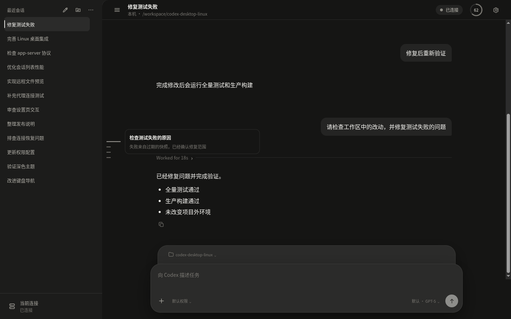

# Codex Desktop Linux

[English](README.md)

基于 Tauri 2、React、TypeScript 和 Rust 构建的独立 Linux Codex app-server 协议桌面客户端

> [!IMPORTANT]
> 这是非官方社区项目，与 OpenAI 不存在隶属、赞助或背书关系。Codex 和 OpenAI 是 OpenAI 的商标

> [!WARNING]
> 项目仍在积极开发，0.x 版本中的协议和用户界面可能继续变化



截图由项目的确定性视觉回归场景生成，不包含账户或 app-server 数据

## 功能

- 通过本机 stdio 连接 Codex app-server 进程
- 通过直连 TLS、HTTP CONNECT、SOCKS5 或 SSH direct-tcpip 实验性连接远程 WebSocket app-server
- 保存服务器和代理配置，并通过 Linux Secret Service 存储凭据
- 恢复会话，展示流式回答和工具活动，处理审批、追加、停止和分叉
- 配置模型、思考程度、工作目录、审批策略和沙箱策略
- 安全渲染 Markdown，并预览常见的本机与远程文件引用
- 支持原生多窗口、单实例深链、桌面通知和账户剩余限额展示

## 与官方桌面客户端的区别

本项目使用相同的 Codex app-server 协议，但部署重点与[官方桌面客户端](https://learn.chatgpt.com/docs/app)不同

| 方面 | Codex Desktop Linux | 官方桌面客户端 |
| --- | --- | --- |
| 平台 | 面向 Linux 原生桌面使用，计划提供 AppImage、deb 和 rpm | 官方文档面向 macOS 和 Windows 桌面应用 |
| 自托管远程 Codex | 管理多个本机或自托管远程 app-server，可通过直连 WebSocket、HTTP CONNECT、SOCKS5 或 SSH 连接 | 已公开的桌面工作流以本机项目、worktree 和 OpenAI 托管的云端任务为主，[Codex CLI](https://learn.chatgpt.com/docs/developer-commands.md?surface=cli)另行提供实验性远程 app-server 能力 |
| 关闭客户端 | 独立托管的远程 app-server 保持运行，且任务不需要审批或用户输入时，关闭桌面客户端后当前任务仍可继续 | 本机桌面工作流受桌面应用生命周期约束，云端任务则在 OpenAI 托管环境执行 |
| 网络边界 | 客户端主机只需访问配置的 app-server，无需直接访问 OpenAI；app-server 主机仍需完成认证并访问 OpenAI 或配置的模型服务 | 网络要求取决于所选官方工作流是在本机还是 OpenAI 云端执行 |

以上只比较部署模型，不是完整功能对照。本项目不替代官方云端、ChatGPT 或平台集成能力

## 项目状态

首个 P0 版本可从 [GitHub Releases](https://github.com/hebo6/codex-desktop-linux/releases) 下载

界面当前仅提供简体中文，尚未实现国际化

远程 WebSocket 传输和部分 app-server 方法在上游仍属于实验能力。请仅连接受信任且使用 TLS 保护的端点，并在启动任务前检查审批与沙箱策略

计划发布范围见[产品范围](docs/product-scope.md)、[实施计划](docs/implementation-plan.md)和[发布要求](docs/release-requirements.md)

## 运行要求

运行应用需要

- 使用 glibc 2.35 或更高版本的 x86_64 或 aarch64 Linux
- X11 或 Wayland 桌面会话
- 用于持久化凭据的 Linux Secret Service
- 本机 stdio 连接需要安装兼容的 [Codex CLI](https://developers.openai.com/codex/cli)，并提前完成目标账户认证

deb 和 rpm 安装包使用发行版提供的 GTK 3 与 WebKitGTK 4.1。AppImage 会携带 WebKit 运行时依赖

## 首次连接

### 本机 stdio

连接本机 Codex

1. 确认 Codex CLI 可以启动且已完成认证
2. 执行 `command -v codex` 获取可执行文件绝对路径
3. 在 Codex Desktop Linux 中新建“本机 stdio”服务器
4. 将可执行文件路径设置为上一步得到的绝对路径
5. 将 `app-server` 添加为第一个参数，并按需选择默认工作目录
6. 测试并保存连接，选择项目目录后再新建会话

### 远程 WebSocket

远程连接需要在服务端安装兼容的 Codex CLI、完成 Codex 账户认证，并让 app-server 进程独立于桌面客户端运行

首次配置推荐使用 SSH 连接路径，并让 app-server 只监听远程主机的回环地址

1. 在服务端生成具有足够随机性的 capability token，将其保存到只有 app-server 账户可以读取的文件，并记录文件绝对路径
2. 在远程主机启动兼容的 app-server

```bash
codex app-server \
  --listen ws://127.0.0.1:4500 \
  --ws-auth capability-token \
  --ws-token-file /absolute/path/to/codex-app-server.token
```

3. 在“设置 → 代理”中新建指向远程主机的 SSH 代理，并核对主机密钥指纹
4. 新建“远程 WebSocket”服务器，将 URL 设置为 `ws://127.0.0.1:4500`
5. 认证方式选择“Bearer 令牌”，填写服务端 token 文件中的 capability token
6. 连接路径选择已保存的 SSH 代理，确认 `ws://` 提示，测试通过后保存

此方案中的 WebSocket 连接由加密的 SSH 通道承载。由于目标 URL 本身仍是 `ws://`，客户端依然会显示明文连接确认

需要通过公网直连时，应让 app-server 继续监听私有地址或回环地址，并在前方配置可信的 TLS 反向代理。客户端填写公开的 `wss://` URL，保持严格证书校验，并配置匹配的 Bearer 令牌。反向代理必须支持 WebSocket 升级并转发 `Authorization` 请求头

不要向不受信任的网络暴露无认证的 app-server。app-server WebSocket 传输仍属于实验能力，并且监听地址使用 `ws://`，公网所需的 TLS 终止需要单独提供

上面的命令以前台方式运行。若要在关闭桌面客户端后继续执行远程任务，需要使用服务端已有且受信任的进程管理方式独立托管 app-server。关闭 Codex Desktop Linux 只会断开 WebSocket，不会停止该远程进程；等待审批或用户输入的任务需要客户端重新连接后才能继续

## 协议兼容性

协议类型和运行时校验器从上游 Codex 提交 `ac3da4fb1a2ad0ee2f0c867bfa81a5a3a3737f9c` 的实验版 JSON Schema 生成

项目不承诺兼容更早或更新的 Codex 构建，生成、校验和 wire envelope 细节见[协议基线](docs/protocol-baseline.md)

## 开发

### 环境要求

- Node.js 24 或更高版本
- 通过 Corepack 使用 pnpm 11.3.0
- Rust 1.85 或更高版本
- [Tauri 2 Linux 系统依赖](https://v2.tauri.app/start/prerequisites/#linux)

安装锁定的 JavaScript 依赖

```bash
corepack enable
pnpm install --frozen-lockfile
```

以开发模式运行桌面应用

```bash
pnpm tauri dev
```

运行前端和协议测试

```bash
pnpm test
```

运行 Rust 测试

```bash
cargo test --locked --manifest-path src-tauri/Cargo.toml
```

构建前端

```bash
pnpm build
```

构建当前架构且不生成安装包

```bash
pnpm tauri build --debug --no-bundle
```

协议生成和视觉回归流程见[协议基线](docs/protocol-baseline.md)与[视觉回归](docs/visual-regression.md)

## 文档

- [产品需求文档](docs/prd/README.md)
- [技术设计](docs/technical-design.md)
- [测试计划](docs/test-plan.md)
- [发布要求](docs/release-requirements.md)

## 贡献与安全

提交 pull request 前请先阅读 [CONTRIBUTING.md](CONTRIBUTING.md)

请勿通过公开 issue 报告漏洞，应按 [SECURITY.md](SECURITY.md) 提交

## 许可证

项目采用 [Apache License 2.0](LICENSE)

从 OpenAI Codex 生成的协议 Schema 和其他第三方内容保留各自声明，详见 [NOTICE](NOTICE)
