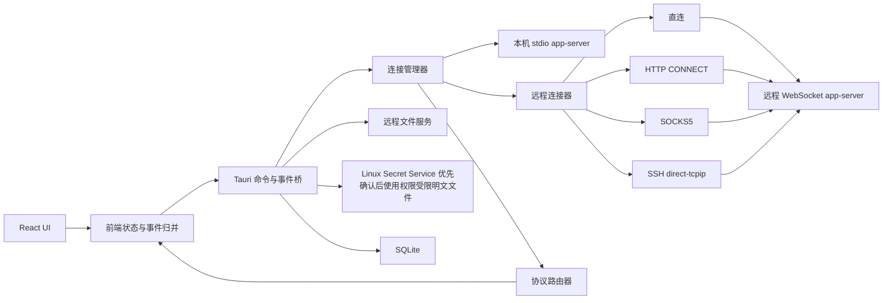

# 技术设计

## 设计边界

客户端负责桌面窗口、连接、凭据、文件访问、本地偏好和用户界面，不实现模型推理、工具执行沙箱或服务端会话语义

app-server 协议定义以 `CODEX_SOURCE_DIR` 指向的只读 Codex 仓库和项目固化的[协议基线](protocol-baseline.md)为准

远程 WebSocket 传输仍是上游实验能力，技术设计必须保留多服务器和远程连接能力，并在用户界面中呈现实验性质

## 技术选型

### 桌面框架

采用 Tauri 2

Tauri 主进程负责进程生命周期、网络连接、文件访问、凭据、系统对话框、窗口状态和操作系统集成，WebView 不直接持有服务器令牌或任意文件系统权限

### 前端

| 类别 | 选型 | 约束 |
| --- | --- | --- |
| UI | React 稳定版 | 使用函数组件和并发渲染能力 |
| 语言 | TypeScript strict | 禁止隐式 any |
| 构建 | Vite | 与 Tauri 开发和打包流程集成 |
| 包管理 | pnpm | 锁定依赖版本并提交 lockfile |
| 应用状态 | Redux Toolkit | 协议事件通过确定性 reducer 归并 |
| 请求缓存 | Redux Toolkit Query 或独立 query 层 | 只处理请求状态和分页缓存 |
| 无障碍组件 | Radix UI Primitives | 外观由项目样式控制 |
| 长列表 | TanStack Virtual | 会话列表和长回合按需虚拟化 |
| 样式 | CSS Modules 与 CSS Variables | 不以运行时 CSS 注入为基础方案 |
| Markdown | react-markdown 与 remark-gfm | 禁止渲染原始 HTML |
| 消毒 | rehype-sanitize | 使用项目自定义白名单 |
| 代码高亮 | Shiki Web Worker | 避免阻塞 UI 主线程 |
| 图标 | 单一 SVG 图标集 | 统一视觉尺寸和风格 |

### Rust 后端

| 类别 | 选型 | 职责 |
| --- | --- | --- |
| 异步运行时 | tokio | 进程 IO、网络 IO、定时器和取消 |
| WebSocket | tokio-tungstenite | 远程 app-server 双向通信 |
| TLS | rustls | 避免 OpenSSL 跨发行版差异 |
| HTTP 代理 | hyper 协议组件与 rustls | 建立 HTTP 或 HTTPS CONNECT 隧道 |
| SOCKS 代理 | fast-socks5 | 建立 SOCKS5 认证和 TCP 隧道 |
| SSH 隧道 | russh | 使用 direct-tcpip 通道连接目标地址 |
| JSON | serde 与 serde_json | 协议编解码 |
| 本地数据库 | SQLite 与 sqlx | 保存服务器、窗口、缓存索引和偏好 |
| 凭据 | Linux Secret Service、权限受限明文文件 | 保存令牌和敏感认证字段 |
| 日志 | tracing | 结构化日志和脱敏 |

## 总体架构

| 层 | 负责 | 不负责 |
| --- | --- | --- |
| React UI | 展示、输入、可访问性和局部交互 | 令牌、文件系统、子进程和网络连接 |
| 前端状态层 | 事件归并、派生视图和选择器 | 协议事实持久化 |
| Tauri Rust | 连接、凭据、文件、窗口、数据库和日志 | 业务内容渲染 |
| app-server | 会话、回合、工具、审批、模型和限额 | 客户端窗口和本地偏好 |

## 协议集成

### Schema 与类型

构建流程从固定上游提交生成完整实验版 JSON Schema，再生成 TypeScript 判别联合和运行时校验器

前端边界使用 Ajv 校验 Rust 转发的协议消息，校验失败时只记录不含原始字段值的协议错误摘要，不使用宽松类型吞掉字段差异

协议升级通过更新 Schema 基线、重新生成类型、修复编译错误和运行契约测试完成，具体命令和 wire envelope 约束见 [协议基线](protocol-baseline.md)

### 初始化与路由

每次建立物理连接后先发送 `initialize` 请求，成功后发送 `initialized` 通知

初始化参数声明 `capabilities.experimentalApi = true`，初始化完成前的业务请求进入有界队列

路由器区分客户端请求、服务端通知、服务端请求、成功响应和错误响应

请求 ID 在单条物理连接中唯一，断线后未完成请求统一结束为连接中断，不复用旧 ID

服务端请求必须显式响应，未知服务端请求返回明确协议错误，禁止自动批准或伪造结果

未知通知记录诊断计数并忽略，不能导致整条连接或会话渲染失败

## 连接管理

### 连接共享

同一应用进程内，相同服务器配置和代理配置版本只维护一条物理连接，多个窗口通过连接管理器订阅事件

每个窗口独立保存当前服务器、当前会话、滚动位置、草稿和弹层状态

连接引用计数归零后进入 30 秒空闲期，期间再次使用时复用连接，超过空闲期后正常关闭

### 本机 stdio

客户端按服务器配置启动 app-server 子进程，通过 stdin 和 stdout 交换逐行 JSON 消息

stderr 作为诊断日志单独采集，不得混入协议解析

子进程路径、参数、工作环境和可选环境变量由服务器配置决定，敏感环境变量进入凭据存储

应用正常退出时请求子进程正常关闭并等待有限时间，超时后只结束由本应用启动的子进程

### 远程 WebSocket

客户端连接 `ws://` 或 `wss://` 地址并交换 app-server 消息

认证支持请求头令牌和非敏感自定义请求头，令牌只发送到目标源

远程连接先按配置建立直连、HTTP CONNECT、SOCKS5 或 SSH direct-tcpip 字节流，再使用 WebSocket URL 中的原始目标主机完成 TLS 和 WebSocket 握手

经代理连接 `wss://` 时，证书主机名、SNI 和 WebSocket `Host` 都使用目标服务器主机名

代理只改变传输路径，不改变 app-server 初始化和业务协议

### 连接阶段

连接状态机依次表达目标解析、代理连接、代理认证、隧道建立、目标 TLS、WebSocket 握手和 app-server 初始化

直连或不适用的阶段直接跳过，失败状态保留具体阶段和脱敏错误，供界面展示进度与恢复操作

### 自动重连

非用户主动断开时使用带随机抖动的指数退避，基础间隔为 1 秒、2 秒、5 秒、10 秒、20 秒，最高 30 秒

代理认证失败、SSH 主机密钥变化、配置错误和 TLS 校验失败进入需要用户处理状态，不无限重试

重连使用服务器明确选择的连接路径，代理失败后不得尝试直连

连接恢复后重新初始化并刷新服务器能力、账户限额、当前 thread 和未完成 turn

断线期间没有明确响应的有副作用请求不得自动重发

## 代理设计

### 配置模型

代理是可复用的独立配置，包含稳定 `proxyId`、名称、类型、非敏感连接字段、凭据引用、版本和最后测试结果

多个服务器可以引用同一代理，代理内容变化时版本递增，活动连接保持原字节流，后续重连使用新版本

被服务器引用的代理不能删除，删除未引用代理时同时删除关联凭据和 SSH 主机密钥记录

P0 每条连接最多经过一个代理，不支持代理嵌套或链式跳转

### HTTP CONNECT

代理 URL 支持 `http://` 和 `https://`，未填写端口时分别使用 80 和 443

无论目标服务器使用 `ws://` 还是 `wss://`，都通过 `CONNECT 目标主机:目标端口` 建立隧道

认证支持无认证、Basic 和 Bearer，不实现 NTLM、Kerberos、PAC 或系统代理自动发现

HTTPS 代理先校验代理服务器 TLS 证书，CONNECT 成功后再按目标主机校验目标 TLS 证书

代理认证与目标服务器认证使用独立作用域，服务器认证头不得发送给代理

非 2xx 响应、响应头超限或超时会关闭底层连接，并生成脱敏错误摘要

### SOCKS5

支持 SOCKS5 无认证和 RFC 1929 用户名密码认证，不支持 SOCKS4、SOCKS4a 和 UDP ASSOCIATE

目标地址支持 IPv4、IPv6 和域名

默认由代理解析目标域名，用户可以显式选择本地解析

认证失败、地址类型不支持、网络不可达、主机不可达和连接拒绝映射为不同错误类型

### SSH 隧道

SSH 连接使用 `direct-tcpip` 通道访问 WebSocket 目标，不在本机监听临时端口

认证支持 SSH Agent、私钥和密码，私钥只记录用户选择的本机绝对路径

首次连接未知主机时保存用户确认的算法和 SHA256 指纹，主机密钥变化时阻止连接

用户只能通过编辑代理并显式移除旧主机密钥后重新确认

SSH 通道建立后仍独立校验目标 `wss://` TLS，SSH 加密不能替代目标身份验证

保活只检测 SSH 连接，不产生 app-server 业务请求，达到连续失败次数后关闭连接并进入重连流程

P0 不支持 ProxyJump、多级堡垒机、端口转发命令模板或用户自定义 SSH 命令

## 会话投影

客户端使用 v2 thread 接口完成新建、恢复、列表、读取、归档、取消归档和删除

首次发送任务时才创建 thread，恢复时加载元数据和最近 30 个 turn，向上滚动后通过 `thread/turns/list` 加载更早历史

发送任务创建 turn，运行中输入通过 steer 追加，显式停止通过中断请求完成

增量通知按 `threadId`、`turnId` 和 `itemId` 路由，同一物理连接内按传输到达顺序归并

文本增量只追加到运行态投影，完成通知到达后以最终快照校正内容，重复项目按服务端 ID 幂等处理

连接中断后重新读取 thread 并与服务端快照对账，不以时间戳猜测正文顺序

客户端不在网络错误后自动重发创建 thread、创建 turn、审批或中断等有副作用请求，请求结果不确定时重新读取服务端状态

### ThreadItem 界面映射

| 项目类型 | UI 形态 |
| --- | --- |
| `userMessage` | 用户消息卡片 |
| `hookPrompt` | 低强调提示行 |
| `agentMessage` | AI Markdown 回答 |
| `plan` | 计划活动行和步骤状态 |
| `reasoning` | 可折叠思考摘要 |
| `commandExecution` | 命令活动行 |
| `fileChange` | 文件变更行和差异入口 |
| `mcpToolCall` | MCP 工具活动行 |
| `dynamicToolCall` | 动态工具活动行 |
| `collabAgentToolCall` | 协作代理活动行 |
| `subAgentActivity` | 子代理活动行 |
| `webSearch` | 搜索活动行和来源入口 |
| `imageView` | 图片查看活动行 |
| `sleep` | 等待活动行 |
| `imageGeneration` | 图片生成结果行 |
| `enteredReviewMode` | 审查模式分隔记录 |
| `exitedReviewMode` | 审查结束分隔记录 |
| `contextCompaction` | 上下文压缩记录 |

## 文件与内容处理

### 预览

| 类型 | 实现 |
| --- | --- |
| 纯文本、Markdown、JSON 和源码 | 内置只读文本查看器 |
| 常见图片 | WebView Blob URL 与缩放控件 |
| SVG | 消毒后在隔离上下文渲染 |
| PDF | P1 使用 PDF.js |
| 未知二进制 | 只显示元数据并提供另存为 |

远程路径始终绑定服务器和工作区上下文，不映射成本机路径

预览前读取元数据，并按类型和大小决定完整读取、截断读取或只提供保存

内置预览最大读取 16 MiB，另存为超过 256 MiB 时需要用户确认

远程内容写入 `/tmp` 的应用专属临时目录，用户选择目标后由 Rust 层完成保存，跨文件系统时不得假设重命名具有原子性

### Markdown 与链接

Markdown 禁止原始 HTML，并通过项目白名单移除脚本、事件属性、嵌入对象和任意内联样式

URL 只允许明确白名单协议，远程内容不得访问应用内部 Tauri 地址或携带本地凭据

所有链接经过统一 LinkResolver，组件不得自行打开浏览器或文件系统

外部网页由 Rust 层调用系统默认浏览器，WebView 不导航到远程网站

## 本地数据

配置、数据库和日志遵循 XDG Base Directory 规范

令牌、代理密码、SSH 密码、密钥口令和敏感环境变量优先存入 Linux Secret Service。提交新凭据时若 Secret Service 明确不可用，界面在保存前说明明文风险；只有用户确认后，每条凭据才会以独立明文文件写入应用数据目录的 `credentials` 子目录，目录权限为 `0700`，文件权限为 `0600`。明文凭据不写入 SQLite、前端状态快照或日志

Rust 写入边界要求每次明文回退都携带本次用户确认，避免 Secret Service 在前端探测后失效造成未经确认的降级。锁定、访问拒绝、交互取消、超时和未知后端错误不得触发明文降级。Secret Service 恢复后，新凭据重新优先写入 Secret Service；已有明文凭据保持可读，直至被替换、清除或随对应配置删除

| 数据 | 用途 |
| --- | --- |
| 服务器非敏感配置 | 名称、类型、地址、命令和显示偏好 |
| 代理非敏感配置 | 类型、地址、DNS 模式、超时和引用关系 |
| SSH 主机密钥记录 | 主机、端口、算法、指纹和确认时间 |
| 窗口状态 | 尺寸、位置、当前服务器和当前会话 |
| 草稿 | 未发送文本和结构化令牌引用 |
| 最近项目 | 快速创建会话和排序 |
| UI 偏好 | 主题、侧栏宽度和代码折行 |
| 会话缓存索引 | 离线只读投影和同步时间 |

草稿在停止输入 500ms 后写入，成功发送后清理对应草稿

数据库迁移必须单向、可测试并在事务中执行，失败时禁止用空库覆盖原数据

## 安全边界

- Tauri 使用最小 capability 配置，文件、外部打开、进程和凭据能力由显式命令提供
- WebView 使用严格 CSP，禁止任意远程脚本、内联脚本和非必要网络源
- 服务器令牌和代理凭据只在 Rust 中读取和使用，不通过 Tauri 事件发送给前端
- 明文凭据文件拒绝符号链接、非当前用户所有以及组或其他用户可读写的文件和目录
- 默认严格校验 TLS 证书和主机名，无效证书只作为明确的开发配置
- Markdown、SVG、JSON 和命令输出均视为不可信内容
- 默认日志不记录用户消息、文件正文、令牌、Cookie、认证头、SSH 认证数据和完整敏感环境变量
- 保存到本机只能使用用户明确选择的目标路径

## 性能策略

- 会话列表和长消息流使用虚拟化，当前流式消息、审批和滚动锚点不得被错误卸载
- 协议通知在状态层批量归并，每帧最多提交一次纯文本增量渲染
- 代码高亮、全文搜索和大型 JSON 格式化移入 Worker
- 图片按显示尺寸解码，离开预览后释放 Blob URL
- 原始大型命令输出在状态层分块保存，DOM 只保留可视窗口

## 技术参考

- [Tauri 2 官方概览](https://v2.tauri.app/start/)
- [Tauri Runtime Authority](https://v2.tauri.app/security/runtime-authority/)
- [Tauri Content Security Policy](https://v2.tauri.app/security/csp/)
- [Radix Primitives](https://www.radix-ui.com/primitives/docs/overview/introduction)
- [react-markdown](https://github.com/remarkjs/react-markdown)
- [TanStack Virtual](https://tanstack.com/virtual/latest)
- [hyper](https://github.com/hyperium/hyper)
- [fast-socks5](https://github.com/dizda/fast-socks5)
- [russh](https://github.com/Eugeny/russh)
